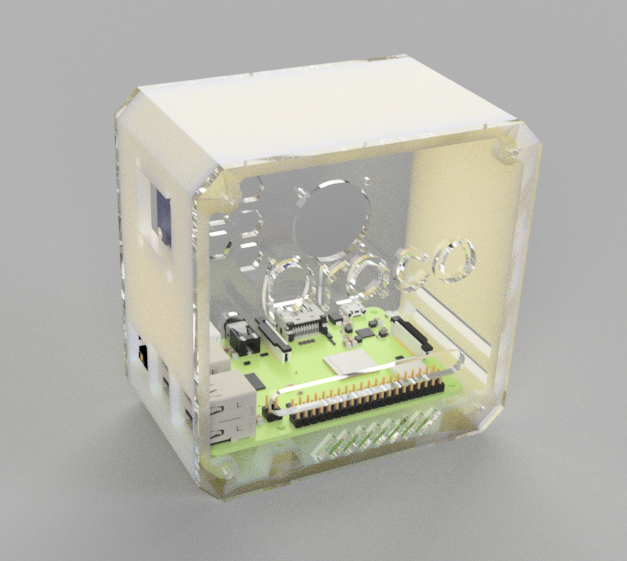

# 【项目】3D打印树莓派小机箱 

起因是自己在上大学时心血来潮购入了一块raspberry 3B+，虽说现在4B型号都已经出来了，但看着仍在角落里吃灰的3B+r仍有些不甘心，现在回想起之前荒废树莓派的原因，一方面在于没找到一份有意思的保姆级教程，另一方面是这块板子虽然体积小巧，但没有一个方便的载体，使得每次和别的外设连接都需要安置一堆导线，实在不美观。

于是乎现在以这个小机箱为载体，来讲讲如何复活一块正在吃灰的Raspberry 3B+。

## 1、建模工作

树莓派模型可从GRABCAD上找到 https://grabcad.com/library/raspberry-pi-3-b-1

所有的物料如下表所示

| 物料       | 型号                           |
| ---------- | ------------------------------ |
| 树莓派     | Raspberry Pi 3B+               |
| 小风扇     | 树莓派3007散热风扇             |
| OLED屏幕   | 0.96inch                       |
| 内六角螺栓 | 8\*M2\*6、8\*M2\*12、4\*M2.5*8 |
| 螺母       | 12\*M2、4\*M2.5                |

模型设计参考了：
- https://github.com/sunfounder/pironman
- https://www.the-diy-life.com/diy-raspberry-pi-4-desktop-case-with-oled-stats-display/

最终完成的效果如下

## 2、系统烧录与SSH连接

考虑到很多同学可能没有显示器，以下都通过远程连接方式，不需要使用到显示器。

### 2.1、系统烧录

首先在下载官方镜像烧录工具：
- https://www.raspberrypi.com/software/

    

之后下载对应系统镜像，我选的是 **64-bit Raspberry Pi OS Lite**，是不带桌面版本，因为不喜欢冗余的桌面环境。

    

将TF卡插入电脑，打开烧录工具，选择镜像，选择TF卡，点击烧录。

**注意**：烧录前记得设置对应所连的WIFI密码，并且开启SSH服务，不然无法远程连接。

    

之后给树莓派上电，让自己的电脑和树莓派连上同一个WiFi，即可通过SSH连接树莓派。

### 2.2、SSH连接

## 3、项目
